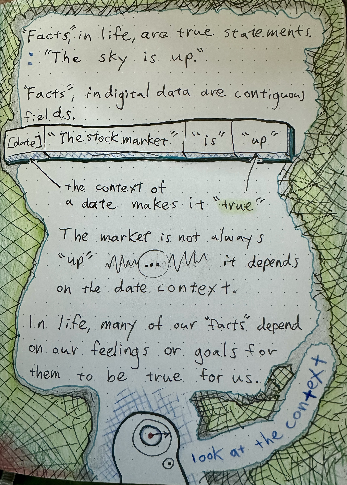
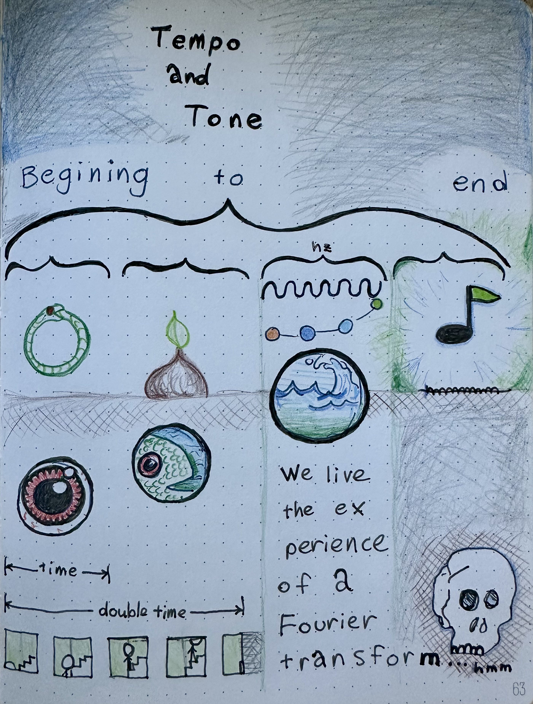

# semantic_bit_theory
## Home of the Semantic Bit

### 📈 Semantic Story Encoding and Decoding

Semantic Bit Theory encodes and decodes time-spanning events into a symbolic taxonomy of what it all means. 🌎 🌠 🍄

### It means what you think it means, if you know what I mean.

In Semantic Bit Theory the taxonomic principle of division is:   
- noun or a verb
- object or a predicate
- particle or a wave
- person or a feeling that person is having   
o_o

## Applications:
## Knowledge Graphs & Integration

- Normalize entities, actions, and states across sources; align schemas via the noun/verb and object/predicate splits; reduce ambiguity and improve linking in heterogeneous data.

## Narrative Analytics & Event Logs

- Turn time-stamped events into particle/wave stories; detect state transitions, root causes, and arcs (e.g., incident timelines, user journeys, lifecycle funnels).

## Affective Computing & Personalization

- Use person/feeling to track internal states alongside actions; power empathetic assistants, mental health journaling, and adaptive UX or NPC behavior.

   
<h2> "You keep saying that word. I don't think it means what you think it means." -- Princess Bride</h2>
    
   
 
   
   

   
 
 
## Schema + Examples
- Schema: `schema/semantic-bit.schema.json`
- Valid instances: `examples/alice-bob.json`, `examples/market.json`
- Invalid instance (for testing): `examples/invalid/invalid-bit.json`

Validate with any JSON Schema Draft-07 validator. Examples:
- Node (ajv-cli): `npx ajv validate -s schema/semantic-bit.schema.json -d examples/*.json`
- Python (jsonschema):
  - `python -c "import json,sys,jsonschema; s=json.load(open('schema/semantic-bit.schema.json'));\nimport glob;\n[jsonschema.validate(json.load(open(p)), s) for p in glob.glob('examples/*.json')];\nprint('ok')"`

Or use the included friendly validator (falls back if `jsonschema` is not installed):
- `python tools/validate.py`  
  Validates `examples/*.json` and `examples/invalid/*.json` and prints per-file results.
- Validate custom paths: `python tools/validate.py examples/*.json` 

## Overlays
- Annotation schema: `schema/semantic-annotation.schema.json`
- Legend/colors: `overlays/legend.json`
- Placeholder annotations for `sbt_23.png`: `annotations/sbt_23.json` (adjust coordinates/labels to match the image).
- Renderer: `tools/render_overlay.py`

Render an SVG overlay (no external deps):
- `python tools/render_overlay.py annotations/sbt_23.json overlays/sbt_23.overlay.svg --legend overlays/legend.json`

Guidance:
- Tag nouns/objects vs verbs/predicates; use bands for wave states and dots for particle events.
- Use links: `updates_state`, `terminates_state`, `caused_by` to connect events and states.

## PNG Inspection
- Script: `tools/png_stats.py`
- Basics: `python3 tools/png_stats.py sbt_23.png`
- With histograms: `python3 tools/png_stats.py sbt_23.png --hist --bins 16`
- With ASCII preview: `python3 tools/png_stats.py sbt_23.png --ascii --width 80`

Outputs:
- Reports size, bit depth, color type, interlace, and average color for RGB/RGBA 8‑bit PNGs.
- Histograms: per‑channel relative bars with configurable bins.
- ASCII: grayscale preview (no ANSI), auto aspect-corrected for terminals.

## Text Extraction (OCR)
- Quick CLI (requires Tesseract installed):
  - Windows (PowerShell): `Get-ChildItem *.png | % { tesseract $_.FullName (Join-Path "text" $_.BaseName) -l eng --psm 6 }`
    - Create output dir first: `New-Item -ItemType Directory -Force text`
  - macOS/Linux (bash): `mkdir -p text && for f in *.png; do tesseract "$f" "text/${f%.*}" -l eng --psm 6; done`
- Python helper: `tools/ocr_extract.py` (uses Pillow + pytesseract)
  - Install deps: `pip install pillow pytesseract` and install Tesseract OCR engine (brew/choco/scoop/apt).
  - Example: `python tools/ocr_extract.py sbt_*.png --outdir text --lang eng --psm 6 --scale 1.5 --preprocess thresh`
  - Writes one `.txt` per image under `text/`.

## CI
- GitHub Actions workflow: `.github/workflows/validate.yml`
- On each push/PR it:
  - Installs Python and `jsonschema`.
  - Validates all valid examples: `python tools/validate.py examples/*.json`.
  - Ensures invalid examples fail validation (job fails if they don’t).

## Pre-commit Hook
- Config: `.pre-commit-config.yaml`
- Installs a local hook that runs `python tools/validate.py` on staged JSON files under `examples/` (excluding `examples/invalid/`).

Setup:
- `pip install pre-commit`
- `pre-commit install`
- Optional one-time run on entire repo: `pre-commit run --all-files`

Notes:
- The hook installs `jsonschema` in its own environment for full validation.
- Invalid examples are excluded from the hook but enforced by CI.

Both example files reference the schema via `$schema` and demonstrate:
- Person/feeling wave state updated by a particle event (`examples/alice-bob.json`).
- Market wave trend terminated by a particle crash (`examples/market.json`).

## Goal: 
Encode and decode time-spanning events into a compact, symbolic system that captures “what it all means” as stories evolve.

## Core unit (“semantic bit”): 
A minimal piece of meaning that situates something in a story along simple, universal semantic splits.

## Scope: 
Semantic encoding, representations, and narratives over time.
Dual Axes (Taxonomic Splits)

- Noun vs Verb: Entities/things vs actions/relations.
- Object vs Predicate: The “thing” vs the statement/property about it.
- Particle vs Wave: Discrete item vs extended, evolving state across time.
- Person vs Feeling: A subject/agent vs the internal state that subject experiences.

## How It Works (Intuition)

- Bits as roles: Each semantic bit places a piece of information on one side of a split (e.g., noun vs verb) to clarify its role in meaning.
- Compositionality: Bits combine into higher-level structures—events, arcs, then stories—preserving who did what, to whom, with what state, over time.
- Time encoding: “Wave-like” bits track persistence and change (e.g., moods, intentions), while “particle-like” bits mark discrete events.

## Simple Example

“Alice loves Bob on Monday.”
Noun/Object: Alice, Bob
Verb/Predicate: loves
Particle: the Monday event of expressing love
Wave: the ongoing state of love across days
Person vs Feeling: Alice (person) having love (feeling)

## Why These Splits Help

- Clarity: Forces each piece of data into a crisp role, reducing ambiguity.
- Portability: Simple, universal distinctions travel well across domains.
- Narrative fit: Cleanly models both snapshots (events) and continuities (states).

## Positioning

Compared to logic/graphs: Like subject–predicate graphs and event schemas, but organized explicitly around a few stable semantic axes.
Use cases: Story understanding, event logging, knowledge graphs, affective computing—anywhere meaning evolves over time.

## Why this helps

### Disambiguation:    
Each token is forced into crisp roles along the splits, reducing ambiguity.
### Time-awareness:    
Particle vs wave keeps events and states distinct but connected.
### Human-centric:    
Person vs feeling captures inner state alongside action, improving narrative fidelity.
