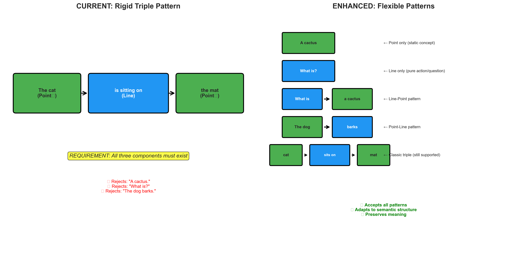
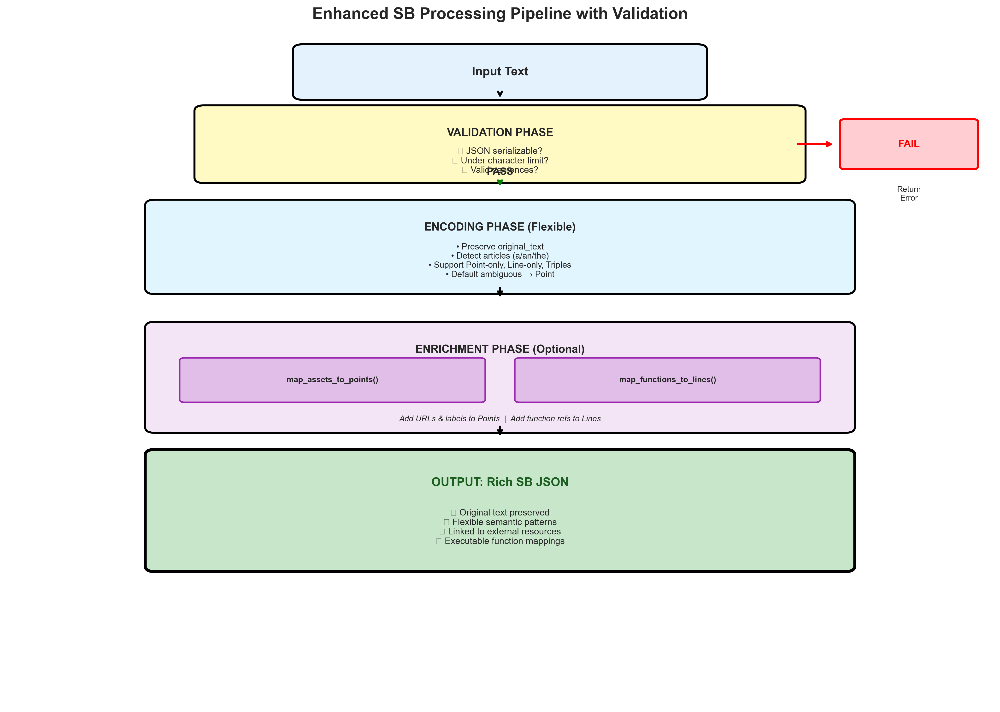
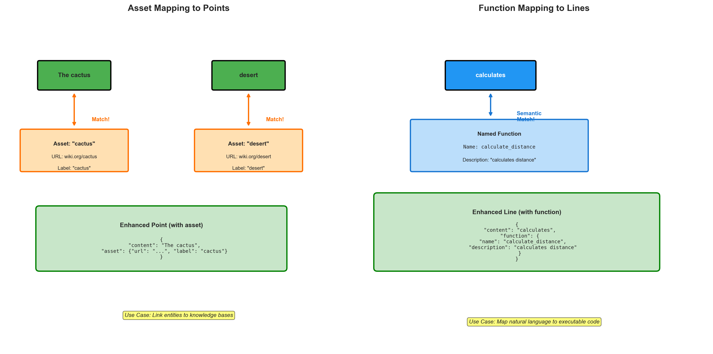
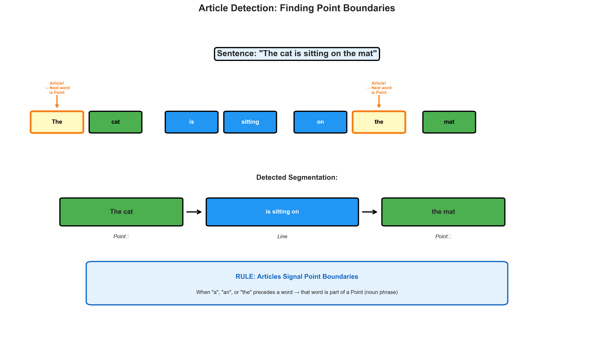

# Semantic Bit Theory Enhancement - Executive Summary

## Document Overview

**Full Plan**: [enhancement_plan.md](enhancement_plan.md) (detailed technical specification with diagrams)

**Status**: PLANNING PHASE - No code changes yet, awaiting approval

---

## Key Changes at a Glance

### 1️⃣ Preserve Original Text
- Add `original_text` field to all semantic structures
- Enables consuming apps to display complete, unmodified sentences
- Maintains authorial intent and formatting

### 2️⃣ Pre-Encoding Validation
- New `validate_text_for_encoding()` method
- Checks: JSON serializable? Under character limit? Valid sentences?
- **Guarantee**: If validation passes → encoding WILL succeed
- Prevents partial failures and encoding errors

### 3️⃣ Flexible Semantic Patterns ⭐ **MAJOR CHANGE**
**Current**: Every sentence MUST be Point₁ → Line → Point₂ (rigid triples)

**Enhanced**: Support multiple patterns based on semantic meaning:
- **Point only**: "A cactus." (static concept)
- **Line only**: "What is?" (pure action/question)
- **Line → Point**: "What is a cactus?" (question structure)
- **Point → Line**: "The dog barks." (subject-action)
- **Point → Line → Point**: "The cat sits on the mat." (classic triple - still supported!)

**Interpretation**: Not all meaning requires all three components. Some meanings are inherently static (Points) or dynamic (Lines). This aligns with the dual-axes theory (noun/verb, object/predicate, particle/wave).

### 4️⃣ Ambiguous Sentence Handling
- Rule: If sentence structure cannot be determined → classify as **Point** (default)
- Rationale: Treat uncertain utterances as conceptual declarations
- Aligns with "particle" in particle/wave duality

### 5️⃣ Article Detection Enhancement
- Rule: "a", "an", "the" before a word → that word is part of a Point/noun phrase
- Improves Point boundary detection accuracy
- Better noun phrase identification

### 6️⃣ Line-First Sentences
- Allow sentences to start with Lines (e.g., questions)
- Example: "What is a cactus?" → "What is" (Line) + "a cactus" (Point)
- Captures interrogative and action-first structures

### 7️⃣ Named Assets Mapping
- Map external resources (URLs + labels) to Points
- Enables linking entities to knowledge bases, images, multimedia
- Rich, hyperlinked semantic graphs

### 8️⃣ Named Functions Mapping
- Map executable functions (name + description) to Lines
- Enables natural language → code execution
- Executable semantic graphs and NLP interfaces

---

## Visual Documentation

All concepts are illustrated with high-quality diagrams:

| Diagram | Description |
|---------|-------------|
|  | Rigid vs. Flexible Patterns |
|  | Enhanced Processing Pipeline |
|  | External Resource Linking |
|  | Point Boundary Detection |

---

## Implementation Phases

### Phase 1: Core Enhancements
- Original text preservation
- Validation method
- Flexible pattern support
- Article detection improvements

### Phase 2: Pattern Detection
- Line-first sentence detection
- Pattern classification system
- Comprehensive test coverage

### Phase 3: External Mapping
- Asset mapping implementation
- Function mapping implementation
- Matching logic (exact, fuzzy, semantic)

### Phase 4: Testing & Documentation
- Test suite for all patterns
- Validation edge cases
- Migration guide for existing code

---

## Backward Compatibility

**Strategy**: Version field in JSON output
```json
{
  "version": "2.0",  // New flexible format
  "sentences": [...]
}

// or

{
  "version": "1.0",  // Classic triple-only format
  "sentences": [...]
}
```

Auto-detection: Version set based on output structure

---

## Expected Schema Changes

### Current (v1.0 - Rigid)
```json
{
  "sentences": [
    {
      "point1": "required",
      "line1": "required",
      "point2": "required"
    }
  ]
}
```

### Enhanced (v2.0 - Flexible, Always-Object Structure)
```json
{
  "version": "2.0",
  "sentences": [
    // Pattern A: Point only
    {
      "type": "point",
      "content": {
        "content": "A cactus"
      },
      "original_text": "A cactus."
    },

    // Pattern B: Line-Point (with asset mapping)
    {
      "type": "line-point",
      "line": {
        "content": "What is"
      },
      "point": {
        "content": "a cactus",
        "assets": [
          {
            "url": "https://wiki.org/cactus",
            "label": "cactus"
          }
        ]
      },
      "original_text": "What is a cactus?"
    },

    // Pattern C: Classic triple (with function mapping)
    {
      "type": "triple",
      "point1": {
        "content": "The cat"
      },
      "line1": {
        "content": "is sitting on",
        "functions": [
          {
            "name": "locate_object",
            "description": "determines spatial relationship"
          }
        ]
      },
      "point2": {
        "content": "the mat"
      },
      "original_text": "The cat is sitting on the mat."
    }
  ]
}

Note: Points/Lines ALWAYS objects with "content" field.
Assets/functions are arrays, only present when matches exist.
```

---

## Questions for Review

Before proceeding to implementation, please clarify:

1. **Character Limit**: What should `max_chars` be for validation? (Suggested: 10,000)

2. **Asset/Function Matching**: Which matching strategies to support?
   - Exact string match only?
   - Fuzzy matching (e.g., "cactus" matches "the cactus")?
   - Semantic similarity using embeddings?

3. **Type Field Naming**: Approve the naming scheme?
   - `"type": "point" | "line" | "triple" | "point-line" | "line-point"`
   - Or prefer different names?

4. **Multiple Asset Matches**: If a Point matches multiple assets, include:
   - All matches (array)?
   - First match only?
   - Best match (by some score)?

5. **Optional vs Required**: Should `asset` and `function` fields be:
   - Optional (only present if mapping exists)?
   - Always present (null if no mapping)?

---

## ✅ Approved Decisions (2025-10-26)

All questions have been answered and Codex review completed:

1. **Character Limit**: ✅ Approved `max_chars = 10,000` (configurable)

2. **Asset/Function Matching**: ✅ Token-based exact word matching
   - Case and punctuation insensitive
   - Unicode normalization (NFKC + casefold)
   - NOT substring matching

3. **Type Field Naming**: ✅ Approved
   - `"point" | "line" | "point-point" | "point-line" | "line-point" | "triple"`

4. **Multiple Asset Matches**: ✅ All matches (arrays)

5. **Field Presence**: ✅ Optional (only when mappings exist)

6. **Data Structure**: ✅ Always-object for Points/Lines
   - Consistent `"content"` field structure
   - Prevents mixed-typing issues for consumers

7. **Fragment Type**: ❌ Rejected - default ambiguous to "point"

8. **Confidence Scores**: ❌ Rejected - unnecessary complexity

**Codex Review Status**: Complete - key improvements adopted, over-engineering rejected

---

## Benefits Summary

✅ **Flexibility**: Handles diverse sentence structures naturally
✅ **Robustness**: Validation prevents failures before encoding
✅ **Richness**: External links add context and functionality
✅ **Fidelity**: Original text preservation maintains authenticity
✅ **Clarity**: Clear semantic patterns for different situations
✅ **Extensibility**: Asset/function mapping enables advanced use cases
✅ **Theory Alignment**: Better reflects dual-axes framework (not everything is a triple!)

---

## Next Steps

1. **Review** this summary and the full plan in [enhancement_plan.md](enhancement_plan.md)
2. **Examine** the visual diagrams in `docs/images/`
3. **Answer** the clarifying questions above
4. **Approve** or request modifications to the plan
5. **Proceed** to implementation once approved

---

*Ready to evolve Semantic Bit Theory from rigid triples to flexible, context-rich semantic patterns!*
