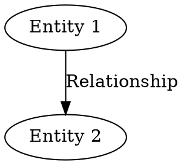

# Examples and Usage Patterns

This document provides comprehensive examples of using semantic-bit for various text processing and graph generation tasks.

## Quick Examples

### Basic Text Encoding
```bash
# Encode a simple sentence
semantic-bit encode "The cat is sitting on the mat."

# Output:
{
  "sentences": [
    {
      "point1": "The cat",
      "line1": "is sitting on",
      "point2": "the mat"
    }
  ]
}
```

### Pipeline to Graph
```bash
# Complete pipeline: text → semantic JSON → DOT graph
echo "The scientist is studying quantum mechanics." | \
  semantic-bit encode | \
  semantic-bit decode --name "ScienceGraph"

# Output:
digraph ScienceGraph {
  p1 [label="The scientist"];
  p2 [label="quantum mechanics"];
  p1 -> p2 [label="is studying"];
}
```

## Sample Files

The `examples/` directory contains ready-to-use sample files:

- **`sample_text.txt`** - Example input text optimized for SBT parsing
- **`sample_output.json`** - Expected JSON output from encoding the sample text
- **`sample_graph.dot`** - DOT graph generated from the JSON output

### Working with Sample Files

```bash
# Process the sample text file
semantic-bit encode -f examples/sample_text.txt -o output.json

# Generate graph from JSON
semantic-bit decode -f output.json -o graph.dot

# View the results
cat output.json
cat graph.dot
```

## Common Usage Patterns

### File Processing
```bash
# Process text files
semantic-bit encode -f document.txt -o semantic_output.json
semantic-bit encode -f article.txt | semantic-bit decode > article_graph.dot

# Process multiple files in a workflow
for file in *.txt; do
  semantic-bit encode -f "$file" -o "${file%.txt}_semantic.json"
done
```

### Pipeline Operations
```bash
# Custom graph names
semantic-bit encode -f story.txt | semantic-bit decode --name "StoryGraph" > story.dot

# Compact JSON output
semantic-bit encode "Quick example." --indent 0

# Pretty-printed output  
semantic-bit encode "Detailed example." --indent 4
```

### Integration with Graphviz
```bash
# Generate visual graphs (requires Graphviz installation)
semantic-bit encode -f input.txt | semantic-bit decode | dot -Tpng -o graph.png
semantic-bit encode -f input.txt | semantic-bit decode | dot -Tsvg -o graph.svg

# Create interactive HTML
semantic-bit encode -f input.txt | semantic-bit decode | dot -Tsvg > graph.svg
```

## Advanced Examples

### Complex Text Processing
```bash
# Process longer documents
semantic-bit encode -f research_paper.txt -o paper_semantics.json

# Filter and process specific sentences
grep "methodology" document.txt | semantic-bit encode
```

### Batch Processing
```bash
# Process multiple files and combine graphs
semantic-bit encode -f file1.txt | semantic-bit decode --name "Graph1" > combined.dot
echo "" >> combined.dot
semantic-bit encode -f file2.txt | semantic-bit decode --name "Graph2" >> combined.dot
```

### Data Analysis Workflows
```bash
# Extract semantic patterns from logs
tail -f application.log | grep "user action" | semantic-bit encode

# Process structured text data
cat user_stories.txt | semantic-bit encode | jq '.sentences[].line1' | sort | uniq -c
```

## Understanding Output Formats

### Semantic JSON Structure
```json
{
  "sentences": [
    {
      "point1": "Subject entity or concept",
      "line1": "Relationship or action",
      "point2": "Object entity or target"
    }
  ]
}
```

### DOT Graph Structure


## Text Types That Work Well

### Optimal Input Patterns
- **Simple sentences**: "The cat sits on the mat."
- **Auxiliary verbs**: "Birds are flying south."
- **Action verbs**: "Scientists are studying climate change."
- **Prepositional phrases**: "Students learn in the classroom."

### Example Inputs and Expected Outputs

**Scientific text:**
```
Input: "Researchers are analyzing molecular structures."
Output: {"point1": "Researchers", "line1": "are analyzing", "point2": "molecular structures"}
```

**Narrative text:**
```
Input: "The hero was fighting the dragon."
Output: {"point1": "The hero", "line1": "was fighting", "point2": "the dragon"}
```

**Technical documentation:**
```
Input: "The system processes user requests."
Output: {"point1": "The system", "line1": "processes", "point2": "user requests"}
```

## Limitations and Considerations

### Text That May Not Parse Well
- **Complex compound sentences**: "While the cat was sleeping, the dog ran outside and the bird flew away."
- **Questions**: "Where is the cat sitting?"
- **Passive voice**: "The mat was sat on by the cat."
- **Technical jargon**: Highly specialized terminology may not be parsed optimally

### Workarounds for Complex Text
```bash
# Break complex sentences into simpler ones
echo "The cat is sleeping. The dog is running." | semantic-bit encode

# Use preprocessing to normalize text
sed 's/[;,]/ ./g' complex_text.txt | semantic-bit encode
```

## Visualization Examples

### Creating Visual Graphs
```bash
# PNG for presentations
semantic-bit encode -f story.txt | semantic-bit decode | dot -Tpng -Gdpi=300 -o story.png

# SVG for web integration
semantic-bit encode -f data.txt | semantic-bit decode | dot -Tsvg -o interactive.svg

# PDF for documents
semantic-bit encode -f report.txt | semantic-bit decode | dot -Tpdf -o report_graph.pdf
```

### Customizing Graph Appearance
```bash
# Add graph attributes through DOT modification
semantic-bit encode -f input.txt | semantic-bit decode | \
  sed '1s/{/{rankdir=LR; bgcolor=lightblue;/' | \
  dot -Tpng -o styled_graph.png
```

## Legacy Analysis Examples

The original text analysis functionality remains available:

```bash
# Basic text statistics
semantic-bit analyze "Sample text for analysis."

# File analysis with formatting
semantic-bit analyze -f document.txt --indent 2

# Compact output
semantic-bit analyze "Text" --no-indent
```

## Integration with Other Tools

### JSON Processing
```bash
# Extract specific semantic relationships
semantic-bit encode -f text.txt | jq '.sentences[] | select(.line1 | contains("studying"))'

# Count relationship types
semantic-bit encode -f corpus.txt | jq '.sentences[].line1' | sort | uniq -c
```

### Text Processing Pipelines
```bash
# Preprocess with common Unix tools
cat messy_text.txt | tr '[:upper:]' '[:lower:]' | semantic-bit encode

# Filter and analyze
grep "important" document.txt | semantic-bit encode | jq '.sentences | length'
```

This examples documentation provides practical guidance for getting the most out of semantic-bit in various real-world scenarios.