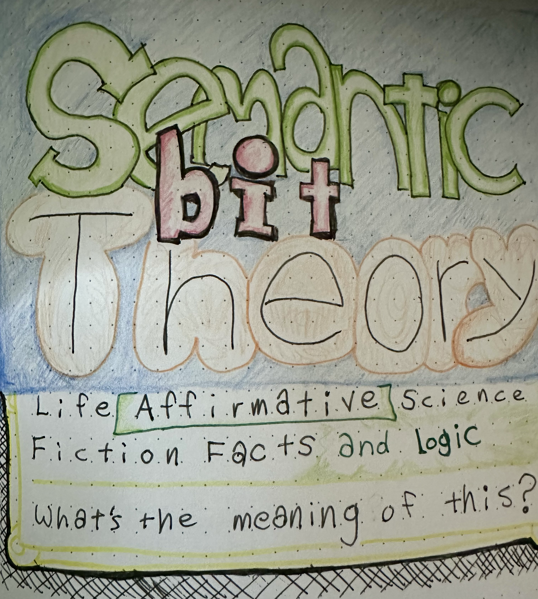
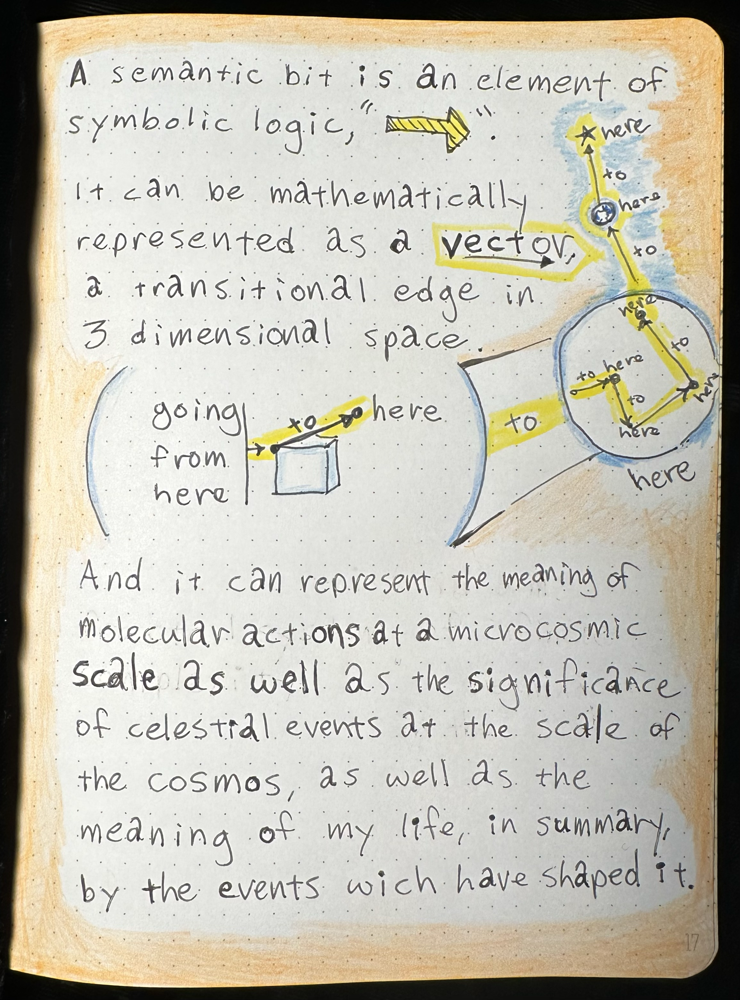
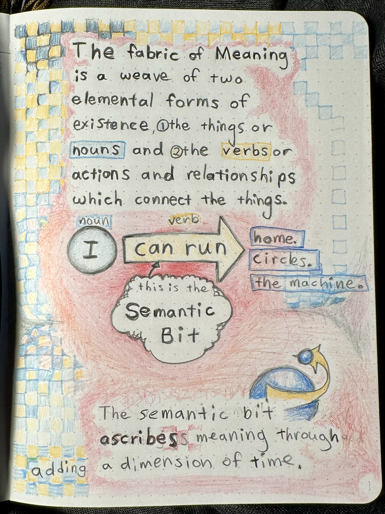
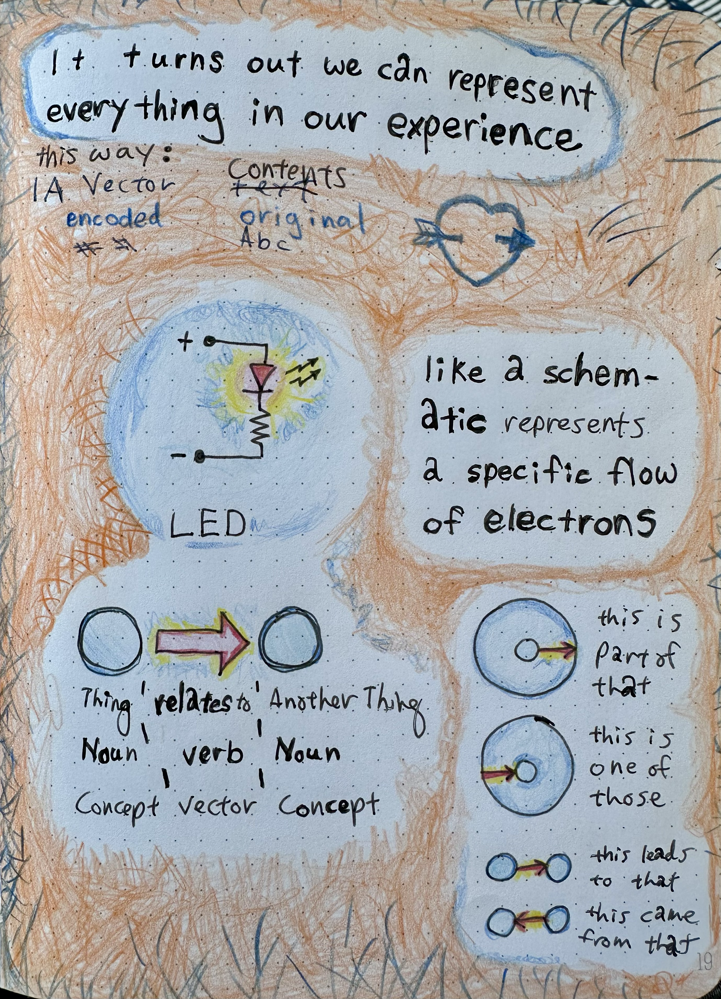
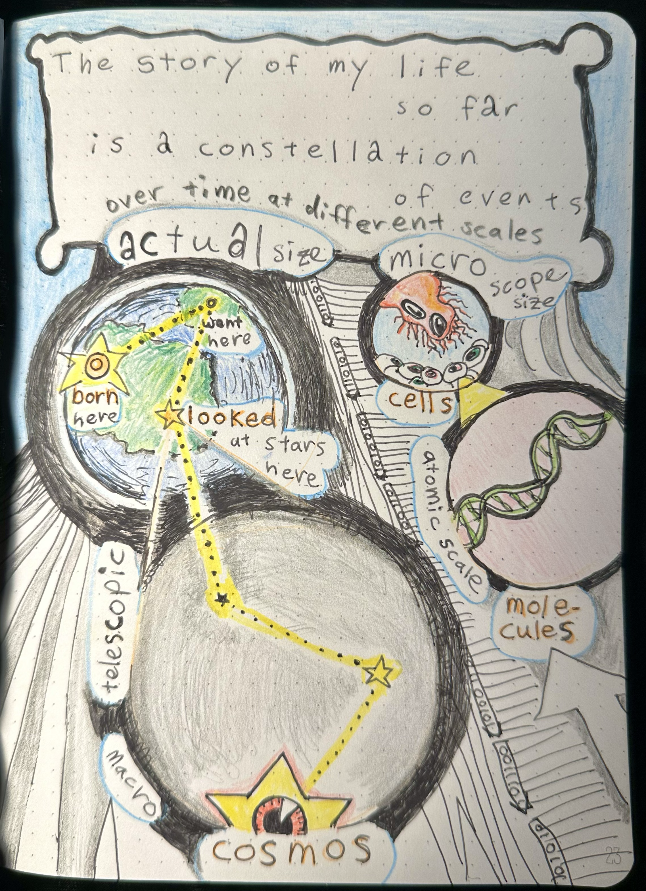
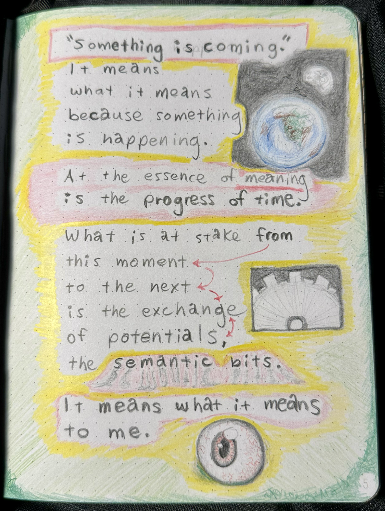
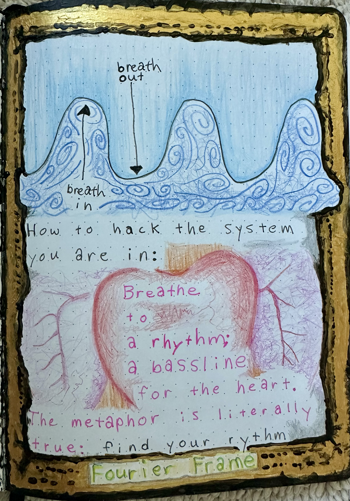
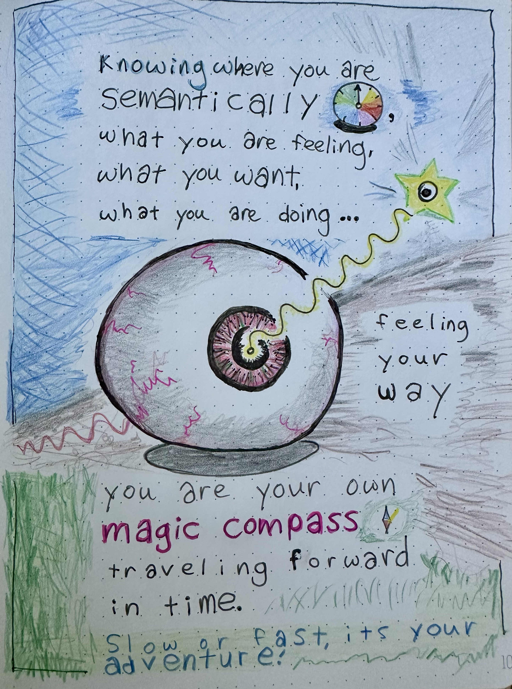
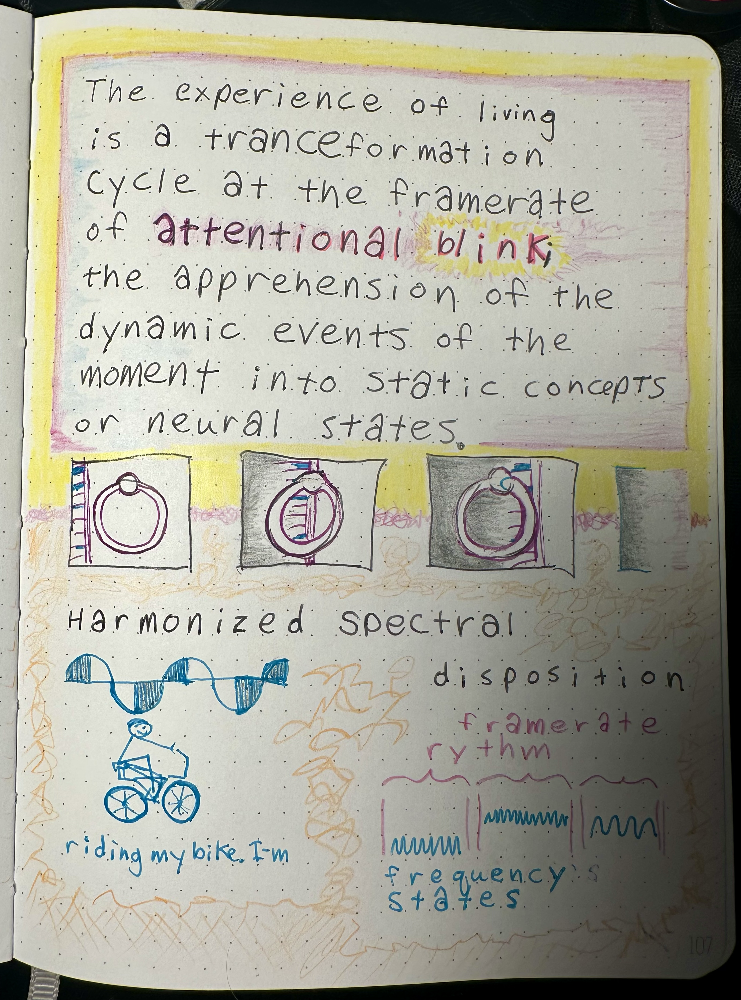
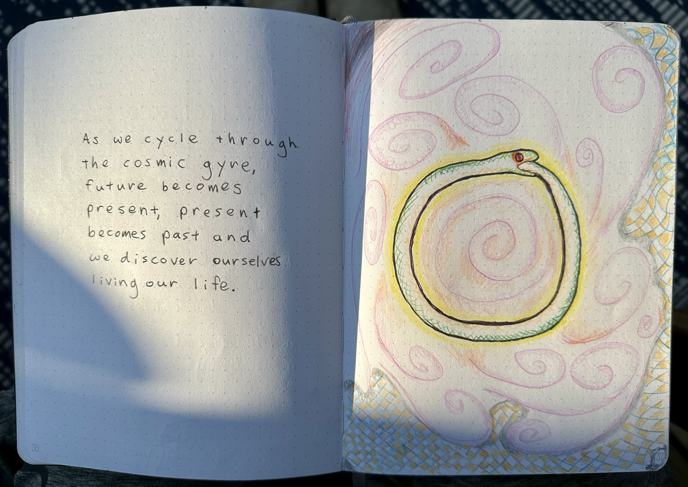

# Semantic Bit Theory - Conceptual Framework

## Home of the Semantic Bit

### 📈 Semantic Story Encoding and Decoding
## Story understanding, event logging, knowledge graphs, affective computing—anywhere meaning evolves over time.
Semantic Bit Theory encodes and decodes time-spanning events into a symbolic taxonomy of what it all means. 🌎 🌠 🍄

### It means what you think it means, if you know what I mean.

In Semantic Bit Theory the taxonomic principle of division is:   
- noun or a verb
- object or a predicate
- particle or a wave
- person or a feeling that person is having   
o_o

## Applications:
## Knowledge Graphs & Integration

- Normalize entities, actions, and states across sources; align schemas via the noun/verb and object/predicate splits; reduce ambiguity and improve linking in heterogeneous data.

## Narrative Analytics & Event Logs

- Turn time-stamped events into particle/wave stories; detect state transitions, root causes, and arcs (e.g., incident timelines, user journeys, lifecycle funnels).

## Affective Computing & Personalization

- Use person/feeling to track internal states alongside actions; power empathetic assistants, mental health journaling, and adaptive UX or NPC behavior.

   
<h2> "You keep saying that word. I don't think it means what you think it means." -- Princess Bride</h2>
    
   
 
   
   

   
 
 
 
 

## Goal: 
Encode and decode time-spanning events into a compact, symbolic system that captures "what it all means" as stories evolve.

## Core unit ("semantic bit"): 
A minimal piece of meaning that situates something in a story along simple, universal semantic splits.

## Scope: 
Semantic encoding, representations, and narratives over time.
Dual Axes (Taxonomic Splits)

- Noun vs Verb: Entities/things vs actions/relations.
- Object vs Predicate: The "thing" vs the statement/property about it.
- Particle vs Wave: Discrete item vs extended, evolving state across time.
- Person vs Feeling: A subject/agent vs the internal state that subject experiences.

## How It Works (Intuition)

- Bits as roles: Each semantic bit places a piece of information on one side of a split (e.g., noun vs verb) to clarify its role in meaning.
- Compositionality: Bits combine into higher-level structures—events, arcs, then stories—preserving who did what, to whom, with what state, over time.
- Time encoding: "Wave-like" bits track persistence and change (e.g., moods, intentions), while "particle-like" bits mark discrete events.

## Simple Example

"Alice loves Bob on Monday."
Noun/Object: Alice, Bob
Verb/Predicate: loves
Particle: the Monday event of expressing love
Wave: the ongoing state of love across days
Person vs Feeling: Alice (person) having love (feeling)

## Why These Splits Help

- Clarity: Forces each piece of data into a crisp role, reducing ambiguity.
- Portability: Simple, universal distinctions travel well across domains.
- Narrative fit: Cleanly models both snapshots (events) and continuities (states).

## Positioning

Compared to logic/graphs: Like subject–predicate graphs and event schemas, but organized explicitly around a few stable semantic axes.
Use cases: Story understanding, event logging, knowledge graphs, affective computing—anywhere meaning evolves over time.

## Why this helps

### Disambiguation:    
Each token is forced into crisp roles along the splits, reducing ambiguity.
### Time-awareness:    
Particle vs wave keeps events and states distinct but connected.
### Human-centric:    
Person vs feeling captures inner state alongside action, improving narrative fidelity.