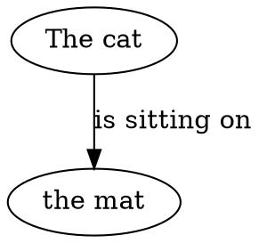

# Semantic Bit Theory Examples

This directory contains example files demonstrating the semantic-bit CLI functionality using Semantic Bit Theory (SBT).

## Files

- **`sample_text.txt`** - Example input text with multiple sentences optimized for SBT parsing
- **`sample_output.json`** - JSON output from encoding the sample text into semantic triples
- **`sample_graph.dot`** - DOT graph generated from the JSON output for visualization

## Usage Examples

### Basic Semantic Bit Operations
```bash
# Encode text to semantic JSON
semantic-bit encode -f sample_text.txt -o sample_output.json

# Decode JSON to DOT graph
semantic-bit decode -f sample_output.json -o sample_graph.dot

# View the semantic triples
cat sample_output.json

# View the generated graph
cat sample_graph.dot
```

### Pipeline Operations
```bash
# Complete pipeline in one command
semantic-bit encode -f sample_text.txt | semantic-bit decode --name "ExampleGraph"

# Pipeline with custom graph name
semantic-bit encode "The scientist is studying quantum mechanics." | semantic-bit decode --name "ScienceGraph"

# Save pipeline output to file
semantic-bit encode -f sample_text.txt | semantic-bit decode > output_graph.dot
```

### Visualization with Graphviz
If you have Graphviz installed, you can generate visual graphs:
```bash
# Generate PNG image
dot -Tpng sample_graph.dot -o sample_graph.png

# Generate SVG for web use
dot -Tsvg sample_graph.dot -o sample_graph.svg

# Generate PDF
dot -Tpdf sample_graph.dot -o sample_graph.pdf
```

### Backward Compatibility (Legacy Analysis)
```bash
# Original text analysis functionality still works
semantic-bit "Hello world"
semantic-bit --file sample_text.txt
semantic-bit analyze "Some text to analyze"
```

## Understanding the Output

### Semantic Triples Structure
The JSON output contains an array of sentences, each parsed into Point-Line-Point triples:
- **point1**: Subject entity or concept (e.g., "The cat")
- **line1**: Relationship or action connecting the points (e.g., "is sitting on")  
- **point2**: Object entity or target concept (e.g., "the mat")

### Graph Structure
The DOT output creates a directed graph where:
- Nodes represent entities/concepts (point1 and point2)
- Edges represent relationships (line1)
- Node deduplication ensures identical entities appear only once
- Edge labels preserve the semantic relationships

## Sample Input → Output

**Input** (`sample_text.txt`):
```
The cat is sitting on the mat.
The dog is running in the park.
Birds are flying south for winter.
The children are playing outside.
```

**Semantic JSON** (`sample_output.json`):
```json
{
  "sentences": [
    {"point1": "The cat", "line1": "is sitting on", "point2": "the mat"},
    {"point1": "The dog", "line1": "is running in", "point2": "the park"},
    {"point1": "Birds", "line1": "are flying", "point2": "south for winter"},
    {"point1": "The children", "line1": "are playing", "point2": "outside"}
  ]
}
```

**Graph DOT** (`sample_graph.dot`):


## Best Practices

The current parser works best with:
- **Simple sentences** with clear subject-verb-object structure
- **Auxiliary verbs** (is, are, was, were, have, has, etc.)
- **Action verbs** ending in -ing or -ed
- **Prepositional phrases** attached to verbs (on, in, at, etc.)

Sentences that may not parse optimally:
- Complex compound sentences
- Passive voice constructions
- Questions and imperatives
- Highly technical or domain-specific language